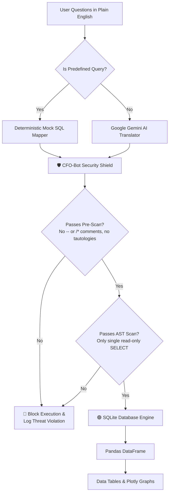

# 💰 CFO-Bot: Relational Text-to-SQL & Security Shield

[](https://www.python.org/)
[](https://streamlit.io/)
[](https://deepmind.google/technologies/gemini/)
[](#-the-cfo-bot-security-shield)

A state-of-the-art **Text-to-SQL** financial assistant that translates natural language business questions into safe, highly optimized SQLite queries, executes them against a local relational database, and renders professional-grade charts and tables.

Designed with an **active multi-layer SQL security shield (AST threat scanner)**, the CFO-Bot demonstrates a robust defense pipeline that prevents SQL injection attacks and unauthorized database mutations in corporate data environments.

---

## 🏛️ System Architecture & Workflow

The system is built on three core pillars:
1. **Interactive UI & Visualizer**: Ingests user input, displays active schemas, details the threat assessment log, and draws responsive, vibrant financial graphs (Bar, Line, Pie, and Area).
2. **Text-to-SQL Translators**:
   * *Local Fallback*: An offline regex mapper responding instantly to high-frequency predefined business questions.
   * *Live Gemini AI*: Connects dynamically to `gemini-1.5-flash` using a schema DDL system prompt to translate *any* complex arbitrary query in real-time.
3. **The Multi-Stage Security Shield**: A rigid gatekeeper that evaluates generated queries *before* passing them to SQLite, preventing data alterations, stacked commands, and classical injection strings.



---

## 📂 Project Structure

```
cfo-bot/
├── .vscode/
│   ├── settings.json         # Workspace variables pointing to the Python venv interpreter
│   ├── launch.json           # Streamlit run configuration (F5 debug trigger)
│   └── tasks.json            # Tasks to run setup.sh or re-seed ledger tables
├── requirements.txt          # Python libraries (Streamlit, Pandas, Plotly, Gemini AI, sqlparse)
├── setup.sh                  # One-click shell script to create venv & install dependencies
├── app.py                    # Main Streamlit coordinator, layout & HTML/CSS styling
├── db_manager.py             # DDL definition & high-fidelity relational seeds generator
├── sql_engine.py             # SQLite Executor & visual multi-stage safety parser (Safety Layer)
├── gemini_service.py         # Google Gemini API connector with system schemas
└── queries_mock.py           # Predefined query map dictionary for zero-setup execution
```

---

## 🔒 The CFO-Bot Security Shield

To safeguard sensitive corporate databases, the **Security Shield** runs every query through a 5-step validation pipeline:

* **Step 1: Input Pre-Scan**: Checks for stacked queries (separated by `;`), SQL comment indicators (`--` and `/*` which are often used to truncate search criteria), and tautology attacks (like `'1'='1'`).
* **Step 2: Lexical Tokenization**: Inspects individual terms to check if they match state-altering SQL commands (`INSERT`, `UPDATE`, `DELETE`, `DROP`, `CREATE`, `ALTER`, `TRUNCATE`, `REPLACE`, `GRANT`, `REVOKE`, `xp_cmdshell`).
* **Step 3: Read-Only Check**: Verifies that the query starts with the `SELECT` keyword, enforcing strict data-query-only boundaries.
* **Step 4: Abstract Syntax Tree (AST) Validation**: (Uses `sqlparse`) Decompiles the SQL structure into an Abstract Syntax Tree to ensure it resolves to a single query object of statement type `SELECT`.
* **Step 5: Execution Routing**: If the query clears all checks, it is routed to a read-only database cursor. If any check fails, it is aborted and a detailed threat report is rendered in the UI.

---

## ⚡ Setup & Run in VS Code (macOS)

### Step 1: Open in VS Code
1. Launch **VS Code**.
2. Click **File > Open Folder...** and select the `cfo-bot` directory.

### Step 2: One-Click Environment Setup
We have bundled a shell script that sets up a clean python virtual environment (`venv`) and installs all package dependencies automatically.

1. Open the VS Code integrated terminal (`Ctrl + ~` or **Terminal > New Terminal**).
2. Run the setup script:
   ```bash
   ./setup.sh
   ```
3. The setup script will run checkmarks, configure your virtual environment, install requirements, and display startup details.

### Step 3: Run the Application (F5 One-Click Launch)
We have pre-configured VS Code workspace launch definitions.

1. Simply press **`F5`** on your keyboard (or click **Run and Debug** in the left sidebar and click the play icon next to **💰 CFO-Bot: Run Streamlit Web App**).
2. VS Code will automatically start Streamlit in headless mode in the background.
3. Open your browser and navigate to:
   ```
   http://localhost:8501
   ```

---

## 💡 Predefined Test Scenarios

Once the dashboard is open, you can test these out-of-the-box queries that require **no API Key**:

1. **Category Spend Analysis**: Click on `"Which category of expenses do we spend the most on?"` to view total allocations mapped across category groups, and select the **Pie Distribution** chart for a stunning relative share breakdown.
2. **Budget Breaches**: Click on `"Which departments exceeded their budget?"` to see standard joints in action, listing Engineering and Marketing, showing their budget limit vs actual aggregated ledger spends, and the exact difference overage.
3. **Treasury Trend**: Click on `"List our monthly cash flow balances."` and switch to the **Area Trend** or **Line Graph** style to trace corporate balance movements over 2025.

---

## 🧪 Testing the Security Sandbox

You can test the robustness of our security filter by entering these statements into the **Safety Threat Sandbox** panel on the right sidebar:

### Test Case A: Safe Query
Input:
```sql
SELECT name, manager FROM departments ORDER BY budget ASC;
```
*Result: Clears all checks, displays results successfully.*

### Test Case B: Stacked Command Injection
Input:
```sql
SELECT * FROM transactions; DROP TABLE departments;
```
*Result: Intercepted! Step 1 flags stacked queries separation `;` and aborts execution to prevent database schema destruction.*

### Test Case C: Malicious Deletion
Input:
```sql
DELETE FROM monthly_forecasts;
```
*Result: Intercepted! Step 2 flags state-mutation keyword `DELETE`, Step 3 flags query does not begin with `SELECT`, and Step 4 flags statement type as `DELETE`. Aborts execution to prevent ledger erasure.*
